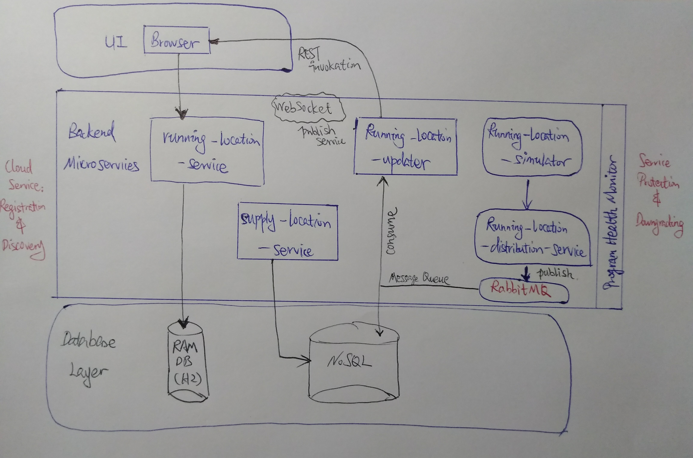

# runner-tracker

### Project Description
This is a project realizes a runner tracker app, similar to
[Codoon](https://www.codoon.com/)
or [Nike+](https://www.nike.com/us/en_us/c/nike-plus/running-app-gps),
using the latest **Java**-series backend architecture and development
technology.  

This project attracted me to think about some high-level problems,
such as **system design**, **microservices** and **distributive system**.
Meanwhile, I got a chance to understand more of the architectural design of
microservices, **cloud application development**,
the way to use **both SQL and NoSQL databases** in one large application,
the place to apply **Message Queues**, etc.  

### Use Cases
1.

### Design Diagram
##### Architectural Overview

### Learning Outcomes

1. [x] Mastered the core knowledge for backend development using **Java 8**,
and understood the code structure and the best practice
2. [x] Understood the theory behind microservices and its design principles,
became skilled in using **Spring Boot**, **Spring Data**, **JPA**,
**In-memory Database (ie. H2)**, and **MongoDB**, and knew how to handle the
configuration and deployment for such a project with these technologies
combined
3. [] Understood the challenges from a **cloud native application** and how to
design microservices in a distributive system; gained knowledge in using
**Spring Cloud** and **Netflix Open Source** to do cloud native application
development
4. [] Understood and mastered service monitoring and health checking
5. [] Practiced software testing theories and methods; being able to write
high-quality code, unit testing and integration testing
